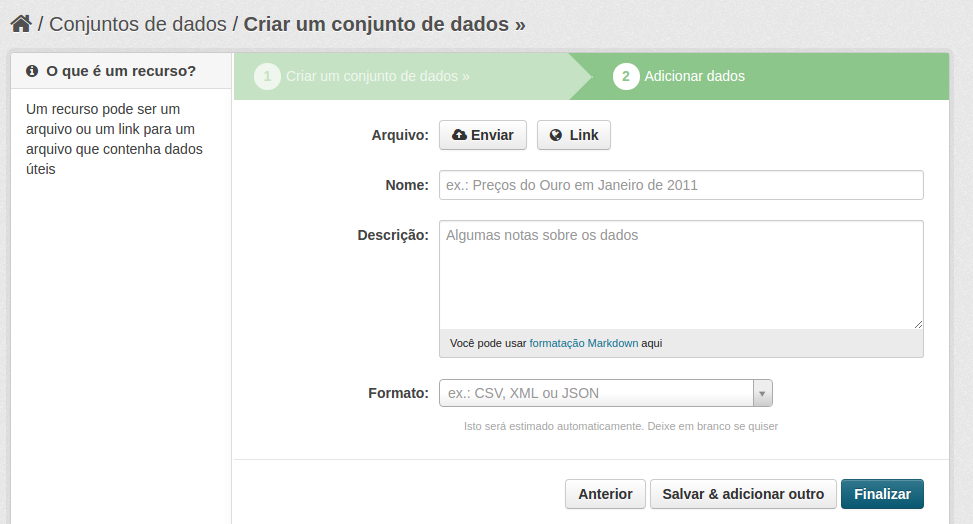

# Adicionando Dados do Inventário

Após preencher as informações do conjunto de dados deve-se preencher as informações de metadados da base de dados. 

 

!!! danger "Atenção"
    Esses arquivos a serem enviados não são os dados da base e sim os metadados da base.  
    __Não se deve enviar um DUMP da base de dados__!

Alguns exemplos de arquivo são: 

* O Modelo de Entidade e Relacionamento (MER) da base de dados;
* Planilha com todos os campos da base e sua descrição;
* Documento com o procedimento de acesso a base de dados;
* Documentação explicativa sobre a base de dados;
* Link para FTP para acesso a base de dados;
* Documento com listagem de outros sistemas que acessam essa base de dados; entre outros.

## Metadados dos arquivos relacionados a base de dados

Arquivo
:   Arquivo a ser enviado de documentação da base de dados ou link para um arquivo.

Nome
:   Nome descritivo do arquivo a ser catalogado.

Descrição
:   Preencher com a descrição do arquivo da base de dados do inventário. A descrição deve ser sucinta informando do que o arquivo trata.

Formato
:   Formato do arquivo a ser catalogado.

## Finalizando o preenchimento

Após o preenchimento deve-se clicar em __Salvar & adicionar outro__ caso possua outros documentos a serem catalogados ou __Finalizar__ se foi catalogado todos os documentos.

[Topo](#topo "Ir para o topo")
