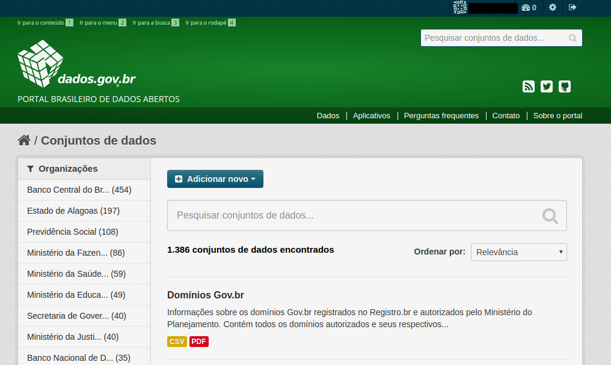
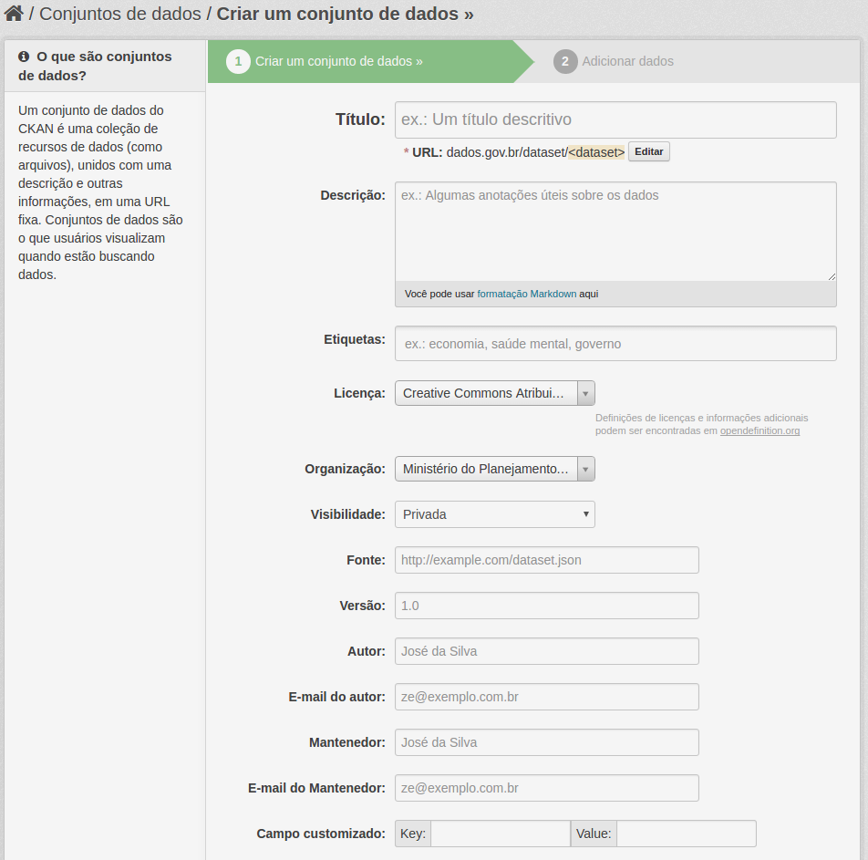

# Catalogando Inventário de bases de dados

O usuário, ao logar no portal, deverá acessar o menu [Dados](http://dados.gov.br/dataset/), para ter acesso à funcionalidade [Adicionar Novo Conjunto de Dados](dados.gov.br/dataset/new), conforme imagem a seguir:

 

!!! danger "Atenção"
    No momento da criação desse manual a funcionalidade "Adicionar novo Inventário" não está funcionando.
    Essa funcionalidade deve estar pronta na próxima versão do portal de dados.

Ao clicar na funcionalidade [Adicionar Novo Conjunto de Dados](dados.gov.br/dataset/new), o editor terá acesso aos seguintes formulários:

* Criar um conjunto de dados
* Adicionar dados

## Inventariando uma base de dados

No formulário __Criar um conjunto de dados__ , o portal vai pedir o preenchimento dos seguintes metadados, conforme imagem abaixo, e em sequência, a descrição de cada campo do metadado a ser preenchido.

### Metadados da base de dados

Título
:   O título deve ser preenchido com os dados do título por extenso da base de dados a ser preenchido.

URL
:   Esse campo é preenchido automaticamente. Se desejar pode alterar para a sigla do sistema.

Descrição
:   Preencher com a descrição da base de dados do inventário. A descrição deve ser sucinta e descrevendo as formas de acesso a mesma.

Etiquetas
:   As etiquetas são os assuntos que a base de dados trata.

Licença
:   A licença dos dados que constam na base de dados. Caso não seja um dado aberto selecione __"Outra (Não Aberta)"__.

Organização
:   O órgão ou entidade que é responsável pela base de dados. Caso seu órgão não esteja aparecendo corretamente entre em contato com <contato@dados.gov.br> para corrigir.

Visibilidade
:   Selecione pública para tornar visível para todos as informações da base de dados que está sendo inventariada.

Fonte
:   Preencha com alguma página (URL) que tenha sido retirado as informações que estão sendo preenchidas ou algum link onde se possa entrar em contato para mais informações.

!!! important "Atenção"
    Deve assegurar que a __"Fonte"__ provêm de uma página legítima da instituição.

Versão
:   Preencha com a versão da base de dados.

Autor
:   Curador responsável pela base de dados. É uma pessoa física e não o órgão.

E-mail do autor
:   E-mail do curador preenchido no campo __"Autor"__.

Mantenedor
:   Responsável técnico pela base de dados. É uma pessoa física e não o órgão.

E-mail do mantenedor
:   E-mail do responsável técnico preenchido no campo __"Mantenedor"__.

## Campos customizáveis

Os campos customizáveis devem ser preenchidos com o par "Chave", "Valor". 

Por exemplo:

Chave (Key) | Valor (Value)
:----------- |:-------------:
URL SIORG da organização | <https://estruturaorganizacional.dados.gov.br/doc/unidade-organizacional/2981>
Telefone do autor | (61) 9999-9999
Sigilo Norma | Não há norma específica
Dados         | Base com dados mensais
Informações Públicas | Não

Os campos customizáveis a serem preenchidos são os seguintes:

Chave: URL SIORG da organização
:   URL com o código que identifica a organização.   
    __Valor__: URL do SIORG correspondente ao órgão responsável pela base de dados.

!!! important "Atenção"
    Para pesquisar qual a URL da organização acesse o [SIORG](https://siorg.planejamento.gov.br/siorg-cidadao-webapp/pages/listar_orgaos_estruturas/listar_orgaos_estruturas.jsf "Acesse o SIORG para encontrar a URL do seu órgão") e troque o código final pelo seu órgão. Por exemplo a URL do Advocacia Geral da União é <https://estruturaorganizacional.dados.gov.br/doc/unidade-organizacional/46>.

Chave: Cargo ocupado pelo autor
:   __Valor__: Cargo do curador preenchido em __"Autor"__

Chave: Telefone do autor
:   __Valor__: Telefone do curador preenchido em __"Autor"__

Chave: Compartilha software?
:   Informe se compartilha, ou deseja compartilhar, este software com Outro órgãos. O compartilhamento prevê disponibilização do código-aberto.    
    __Valor__: __Sim__ ou __Não__

Chave: Por quê não compartilhar? 
:   __Valor__: Justificativa para não compartilhar o sistema.

Chave: Tipo de sigilo
:   Grau de sigilo das informações. Preencha com __'Público'__ se não possue restrição de acesso; __'Pessoal'__ se possue dados pessoais; ou __'Sigiloso'__ se possue qualquer outro tipo de dado sigiloso.    
    __Valor__:  __Público__, __Pessoal__ ou __Sigiloso__

Chave: Sigilo Norma
:   __Valor__: Quais são as normas que determinam e regulam o sigilo dessa informação.

Chave: Atualização
:   Período de atualização.   
    __Valor__: __Anual__, __Semestral__, __Mensal__, __Semanal__, __Diário__, __Sob demanda__ ou __Outro__

Chave: Categorias no VCGE
:   Neste campo, o catalogador deverá fornecer o Vocabulário Controlado de Governo Eletrônico, que é uma lista hierarquizada / temática de assuntos do governo federal que utiliza termos comuns e é voltada para a sociedade.   
    __Valor__: Lista de termos do VCGE.

!!! important "Atenção"
    Para navegar e escolher as categorias acesse o VCGE em <http://vocab.e.gov.br/id/governo>. Para exemplos de preenchimento veja <http://dados.gov.br/dataset/imoveis-dominiais-da-uniao>

Chave: Bases adicionais
:   __Valor__: Lista de bases que são acessadas além da base principal.

Chave: Integrações da base da dados
:   __Valor__: Especifique as integrações com outros sistemas ou base de dados e as tecnologias utilizadas nessas integrações.

Chave: Acesso a órgão
:   Permitiria acesso a bases de dados para órgãos externos (governo federal)?   
    __Valor__: __Sim__, __Sob determinadas condições__, __Apenas orgãos de controle__, __Não permitiria__

Chave: Dados Abertos
:   Existe alguma exportação de dados na forma de dados abertos?   
    __Valor__: __Sim__, __Não__, __Em desenvolvimento__ ou __Prevista__

Chave: URL dos Dados Abertos
:   __Valor__: URL para os dados abertos da base de dados.

Chave: Web Service
:   Existe solução de Web service para fornecer dados?   
    __Valor__: __Sim__, __Não__, __Em desenvolvimento__ ou __Prevista__

Chave: Usuários do Web Service
:   Se existe o Web Service, liste os órgãos que estão usando a solução.   
    __Valor__: Lista de usuários do Web Service

Chave: Arquivo
:   Existe solução de Exportação de arquivo?   
    __Valor__: __Sim__, __Não__, __Em desenvolvimento__ ou __Prevista__

Chave: Usuários do Arquivo
:   Se existe Exportação de Arquivos, liste os órgãos que estão usando a solução.
    __Valor__: Lista de usuários do Arquivo

Chave: Outra solução de interoperabilidade
:   __Valor__: Caso exista descreva outra solução de interoperabilidade para a base de sistemas.

## Finalizando o preenchimento

Após o preenchimento de todos os metados e campos customizáveis deve-se clicar em __Próximo: Adicionar Dados__

[Topo](#topo "Ir para o topo")
