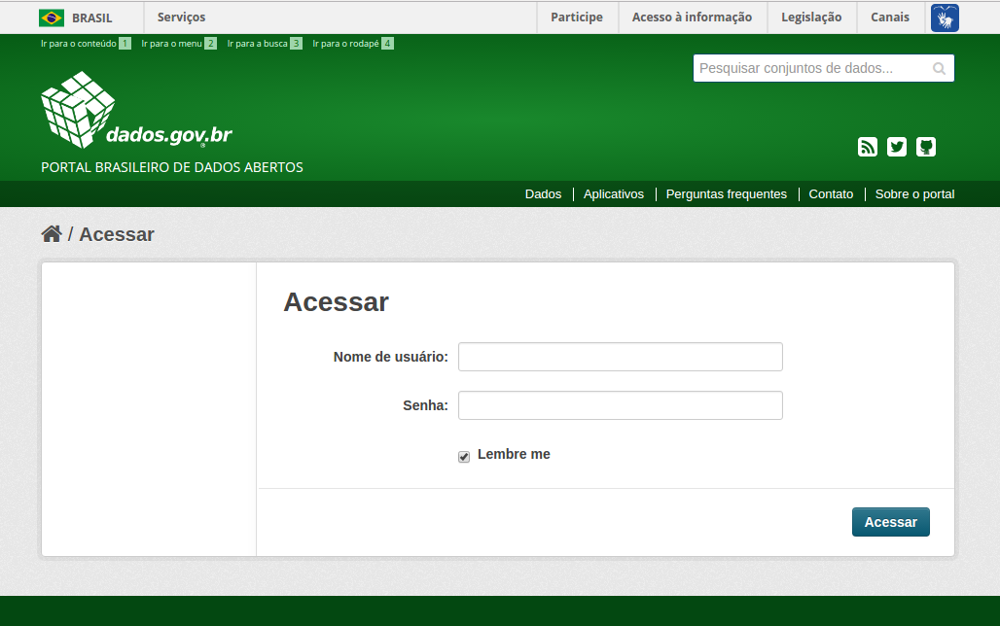

# Manual de Catálogo de Inventário de Bases do Governo Federal

Esse manual serve como orientação para catalogação das bases de dados do Governo Federal Brasileiro. 

!!! caution "Atenção"
    Atenção esse manual não trata de dados abertos ou de aplicativos catalogados no portal de dados.

## Público Alvo

As pessoas que são responsáveis pela [LAI](http://www.acessoainformacao.gov.br/assuntos/conheca-seu-direito/a-lei-de-acesso-a-informacao "Informações sobre a Lei de Acesso a Informação") são os mesmos que devem catalogar o inventário de bases do governo federal.

## Primeiro acesso

A catalogação de dados no portal é realizada por pessoas dos órgãos indicados pelos órgãos que são previamente cadastrados no portal para essa atividade. Esse servidor é o mesmo indicado para catalogar Dados Abertos pela LAI.

A solicitação para catalogação no Portal Brasileiro de Dados somente poderá ocorrer pelos diretores de tecnologia da informação, coordenadores-gerais de tecnologia da informação ou pelos coordenadores das áreas finalísticas e devem ser encaminhadas para o e-mail: <contato@dados.gov.br>

Após o cadastro do responsável pelos conjuntos de dados do órgão no Portal Brasileiro de Dados, será enviado, automaticamente, o “Nome de usuário​” e “Senha​” para que o mesmo realize a catalogação no Portal.[^1]

##  Como acessar

O responsável pela catalogação receberá um e-mail, enviado automaticamente pelo Portal Brasileiro de Dados com as informações de acesso. O usuário deverá
acessar a área de autenticação do [portal](http://www.dados.gov.br/user/login "Fazer login no portal de dados") e preencher os campos “Nome de usuário​” e “Senha​”, de acordo com as informações recebidas por e-mail.

##  Alterando seu perfil

Para verificar como alterar seu perfil por favor acesse o [Manual de Catalogação de Dados Abertos](http://wiki.gtinda.ibge.gov.br/GetFile.aspx?File=%2fManual%20de%20Cataloga%c3%a7%c3%a3o%2fManual-de-Cataloga%c3%a7%c3%a3o-v1.0.pdf&AsStreamAttachment=1&Provider=ScrewTurn.Wiki.FilesStorageProvider&NoHit=1)

[^1]:
    Fonte: [Manual de Catalogação](http://wiki.gtinda.ibge.gov.br/GetFile.aspx?File=%2fManual%20de%20Cataloga%c3%a7%c3%a3o%2fManual-de-Cataloga%c3%a7%c3%a3o-v1.0.pdf&AsStreamAttachment=1&Provider=ScrewTurn.Wiki.FilesStorageProvider&NoHit=1) CC4.0 BY-ND

[Topo](#topo "Ir para o topo")
